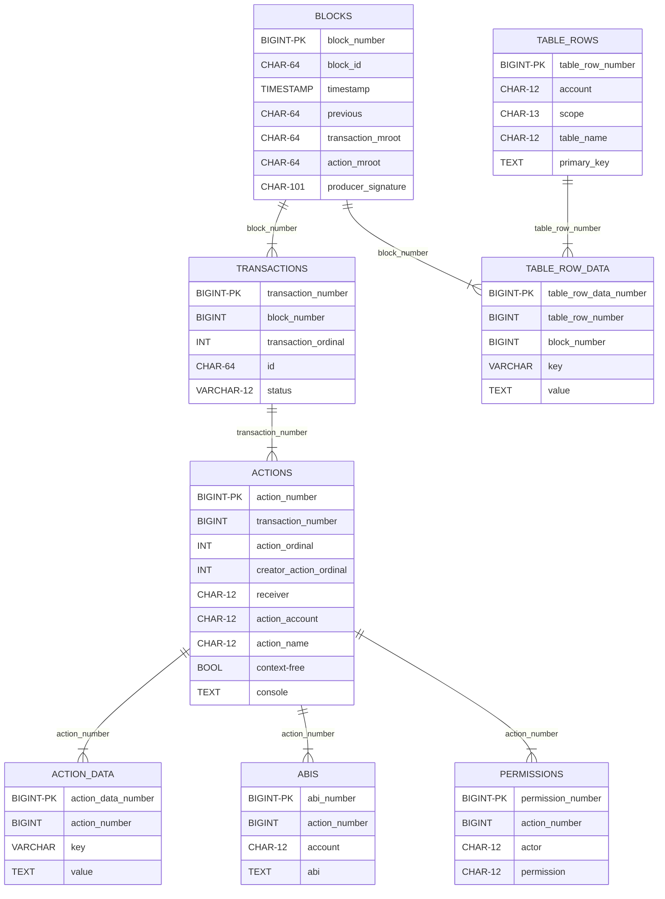

```mermaid
erDiagram

BLOCKS {
BIGINT-PK block_number
CHAR-64 block_id
TIMESTAMP timestamp
CHAR-64 previous
CHAR-64 transaction_mroot
CHAR-64 action_mroot
CHAR-101 producer_signature
}

TRANSACTIONS {
BIGINT-PK transaction_number
BIGINT block_number
INT transaction_ordinal
CHAR-64 id
VARCHAR-12 status
}

ACTIONS {
BIGINT-PK action_number
BIGINT transaction_number
INT action_ordinal
INT creator_action_ordinal
CHAR-12 receiver
CHAR-12 action_account
CHAR-12 action_name
BOOL context-free
TEXT console
}

ACTION_DATA {
BIGINT-PK action_data_number
BIGINT action_number
VARCHAR key
TEXT value
}

TABLE_ROWS {
BIGINT-PK table_row_number
CHAR-12 account
CHAR-13 scope
CHAR-12 table_name
TEXT primary_key
}

TABLE_ROW_DATA {
BIGINT-PK table_row_data_number
BIGINT table_row_number
BIGINT block_number
VARCHAR key
TEXT value
}

PERMISSIONS {
BIGINT-PK permission_number
BIGINT action_number
CHAR-12 actor
CHAR-12 permission
}

ABIS {
BIGINT-PK abi_number
BIGINT action_number
CHAR-12 account
TEXT abi
}

BLOCKS ||--|{ TRANSACTIONS : block_number
BLOCKS ||--|{ TABLE_ROW_DATA : block_number

TRANSACTIONS ||--|{ ACTIONS : transaction_number

ACTIONS ||--|{ ACTION_DATA : action_number
ACTIONS ||--|{ ABIS : action_number
ACTIONS ||--|{ PERMISSIONS : action_number

TABLE_ROWS ||--|{ TABLE_ROW_DATA : table_row_number
```